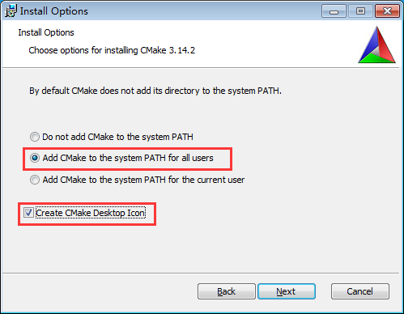
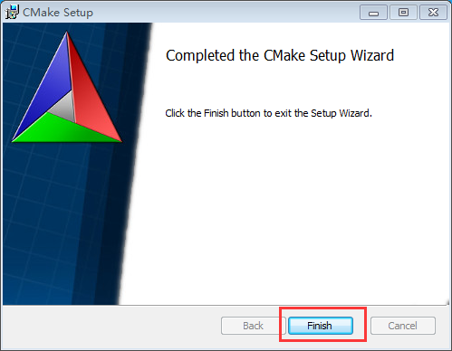
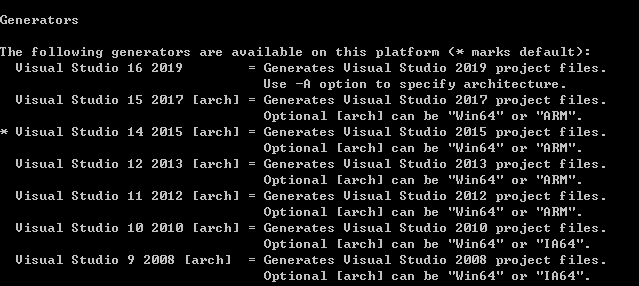

# AWTK-MSVC

## 1 下载并安装 CMake 

### 1.1 下载 CMake

前往 [CMake 官网](https://cmake.org/download/) 下载最新版安装包。


### 1.2 安装 CMake

1. 双击运行安装包，一路点击 【next】；
2. 到如下图步骤时，选中【add CMake to the system PATH for all users】和【Create CMake Desktop Icon】；



3. 再一路点击【next】，并最后点击【install】；
4. 安装成功后，点击【Finish】，如下图所示：



## 2 环境配置

### 2.1 克隆 awtk

```bash
git clone https://github.com/zlgopen/awtk.git
```

### 2.2 下载 HelloDesigner-Demo

在 [AWStudio](https://awtk.zlg.cn/) 中下载示例程序 HelloDesigner-Demo，或者前往 [JihuLab 仓库](https://jihulab.com/awtk/awtk-demo-hello-designer) 下载程序源码。

### 2.3 克隆 awtk-msvc

```bash
git clone https://github.com/zlgopen/awtk-msvc.git
```

​确保 awtk-msvc 与 awtk 及 HelloDesigner-Demo 在同一文件夹下。

## 3 生成VS工程

### 3.1 修改 build_gen.bat 文件

#### 3.1.1 设置渲染模式

可根据需要自行修改：

```bat
@rem 设置渲染模式
@set NANOVG_TYPE=AGGE
@rem set NANOVG_TYPE=GLES2
```

> “rem”为批处理的注释符号，如需修改渲染模式，删去对应语句的“rem“即可。

#### 3.1.2 设置启用谷歌拼音

该项通常无需修改，默认即可：

```bat
@rem 设置启用谷歌拼音
@set PINYIN_ENABLE=ON
```

#### 3.1.3 禁用部分警告

```bat
@rem 禁用部分警告
@set DISABLE_WARNING=ON
```

工程默认禁用 C4244、C4267 及 C4018 警告，用户可自行开启警告。

#### 3.1.4 设置VS平台

可根据用户安装的VS版本（vs2015或以上），自行修改VS平台：

```bat
@rem 设置VS生成器
@set VS_GENERATOR="Visual Studio 14 Win64"
```

​参数中的"Win64"表示生成 64 位工程，如需生成 32 位工程，修改参数为"Visual Studio 14"即可。

​VS_PLATFORM 参数取值可参考下图：



> 在终端上运行 `cmake --help`，可得到上图输出结果。

### 3.2 执行 build_gen.bat 文件

​双击 build_gen.bat 文件，将生成VS工程到build文件夹下。

## 4 打开VS工程

​打开 build 文件夹，双击 awtk-msvc.sln 文件即可打开VS工程。
