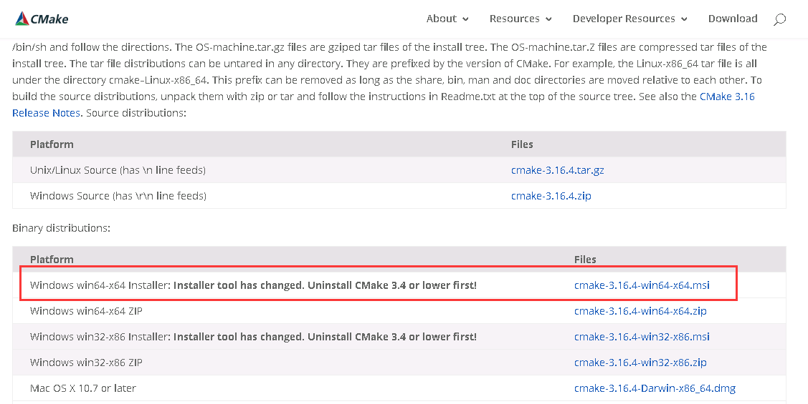

# AWTK-MSVC

## 一、cmake 下载及安装

#### 1. cmake下载

下载网址：https://cmake.org/download/



如图所示下载最新版安装包即可。

#### 2. 安装步骤

1. 双击安装包后，一路点击 【next】

2. 到如下图步骤时，选中【add CMake to the system PATH for all users】和【Create CMake Desktop Icon】

   

3. 再一路点击【next】，并最后点击【install】

4. 等待安装结束后，点击【Finish】

   

## 二、环境配置

#### 1. 克隆 awtk 及 awtk-examples

```
git clone https://github.com/zlgopen/awtk.git
git clone https://github.com/zlgopen/awtk-examples.git
```

#### 2. 克隆 awtk-msvc

```
git clone https://github.com/zlgopen/awtk-msvc.git
```

​	确保awtk-msvc与awtk及awtk-examples在同一文件夹下。

## 三、生成VS工程

#### 1. 修改build_gen.bat文件

##### 1.1 设置渲染模式

​	主要有4种模式，可根据需要自行修改：

	@rem 设置渲染模式
	@rem set NANOVG_TYPE=GLES2
	@rem set NANOVG_TYPE=GLES3
	@set NANOVG_TYPE=AGGE
	@rem set NANOVG_TYPE=AGG
> “rem”为批处理的注释符号，如需修改渲染模式，删去对应语句的“rem“即可。

##### 1.2  设置启用谷歌拼音

​	该项通常无需修改，默认即可：

	@rem 设置启用谷歌拼音
	@set PINYIN_ENABLE=ON

##### 1.3 设置VS平台

​	可根据用户安装的VS版本（vs2015或以上），自行修改VS平台：

```
@rem 设置VS生成器
@set VS_GENERATOR="Visual Studio 14 Win64"
```

​	参数中的“Win64”表示生成64位工程，如需生成32位工程，修改参数为"Visual Studio 14“即可。

​	VS_PLATFORM 参数取值可参考下图：


> 在终端上运行 cmake --help ，可得到上图输出结果。

#### 2. 执行 build_gen.bat 文件

​	双击build_gen.bat文件，将生成VS工程到build文件夹下。

## 四、打开VS工程

​	打开build文件夹，双击 awtk-msvc.sln 文件即可打开VS工程。